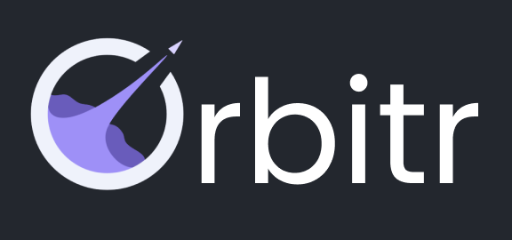
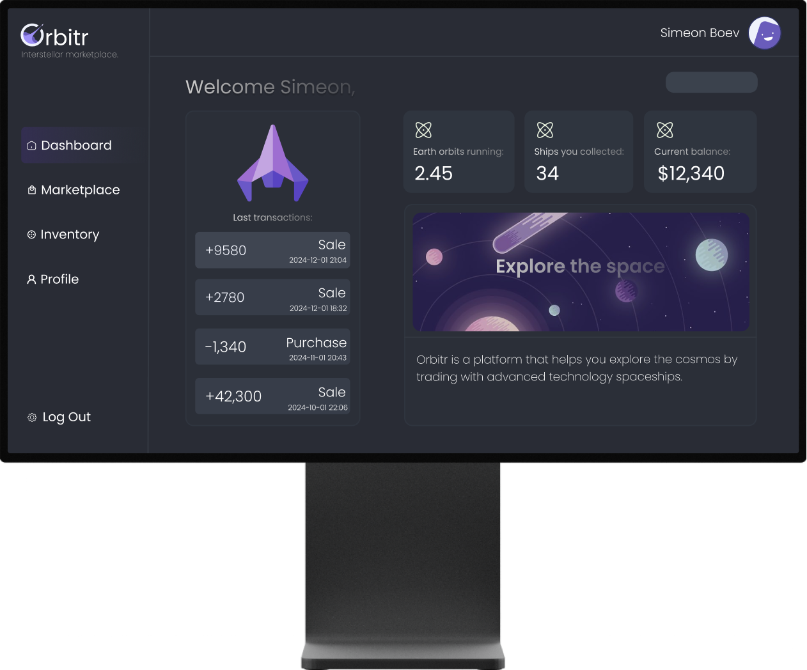

<br>
<p align="center">
  
</p>
<br>

<p align = "center">
    
    
    
    
</p>
<br>

## 🌌 Introduction
  Orbitr is a platform that lets its users trade, collect and explore high technology spaceships used for inter-galactic transport. The project has two main parts, API used for logic and communication with the database, and Website for user interaction. Users authorize and manage their space vehicles or trade with others, and most importantly - explore the Universe!</p>


## 🚀 Application Tech Stack 
  <p align="left"> 
     <a href="https://www.cplusplus.com/"></a>
     <a href="https://spring.io/projects/spring-boot/"></a>
      <a href="https://docs.libcpr.org/introduction.html"></a>
    <a href="https://curl.se/"></a>
  </p>

## 🛰️ Website Tech Stack 
  <p align="left"> 
      <a href="https://vuejs.org/"></a>
      <a href="https://www.typescriptlang.org/"></a>
      <a href="https://html.com/html5/"></a> 
      <a href="https://sass-lang.com/"></a>
      <a href="https://vitejs.dev/"></a> 
  </p> 

  
## 📡 Database Tech Stack 
  <p align="left"> 
    <a ></a>
    <a href="https://azure.microsoft.com/en-us"></a>
   
  </p> 
  
## 🔬 Tools
  <p align="left"> 
    <a href="https://visualstudio.microsoft.com/"></a>
    <a href="https://code.visualstudio.com/"></a>
    <a href="https://www.figma.com/"></a>
    <a href="https://www.postman.com/"></a>
     <a href="https://www.adobe.com/creativecloud.html"></a>

  </p>   

## 🔧 Installation

```
You can download our project by using the green "Code" button.

Or by pasting the following code in your CMD:
git clone https://github.com/codingburgas/2324-technologies-11-transport-assignment-SABoev20.git
```

 ## 🖥 Demo of the project 
  
  <p align="center">
  
  </p>

## ⚙ Website Access

*You can access our website by opening this link with your browser.*
```
https://gray-mushroom-0dcc8a703.2.azurestaticapps.net/
```

*To run the website on your local device, follow these steps:*

```
git clone "the repository"
```
*Navigate to the proper directory*

```
cd application

cd client

cd src
```
*Install node packages*

```
npm install
```
*Run on local surver*

```
npm run dev
```
<br>

## 👽 Credits:

<h4> All credits to me because I made the whole thing myself :P</h4>
<p align="center">
  
</p>
